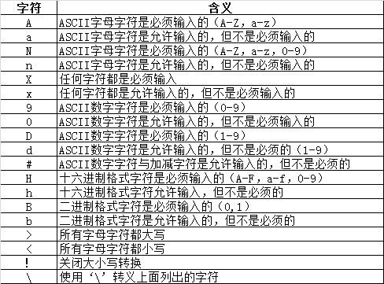

## 主窗口类型
1. QMainWindow
    - 可以包含菜单栏、工具栏、状态栏和标题栏，是最常见的窗口形式。
2. QWidget
    - 不确定窗口的用途，就用QWidget
3. QDialog
    - 是对话窗口的基类，没有菜单栏、工具栏、状态栏。
## QDesktopWidget
```python
from PyQt5.QtWidgets import QDesktopWidget
screen = QDesktopWidget().screenGeometry()
screen.width()  # 屏幕宽度
screen.height() # 屏幕高度
```
## ALabel控件
```
setAlignment(): 设置文本的对齐方式
setIndent(): 设置文本缩进
text(): 获取文本内容
setBuddy(): 设置伙伴关系
setText(): 设置文本内容
selectedText(): 返回所选的字符
setWordWrap(): 设置是否允许换行
```
###### 常用的事件
1. 当鼠标划过控件时触发(进入触发一次，出去触发一次)：linkHovered
2. 当鼠标单击控件时触发：linkActivated
## QLineEdit控件
### EchoModel(回显模式)
1. Normal：正常显示
2. NoEcho：不显示
3. Password：隐藏值
4. PasswordEchoOnEdit: 当失去焦点时以密码形式显示
### 校验器(setInputMask)
1. QIntValidator
2. QDoubleValidator
3. QRegExpValidator
### 掩码
掩码由掩码字符与分隔符字符串组成，后面可以跟一个分号和空白字符，空白字符在编辑后会从文本删除的 
